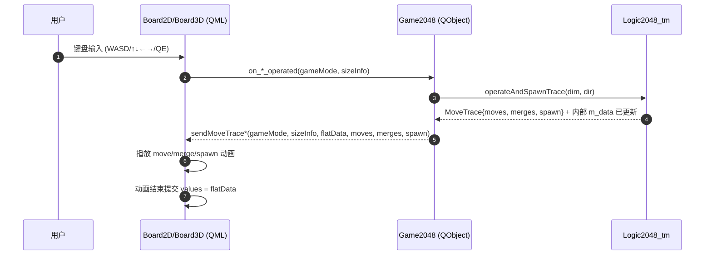

# Game_2048_Quick 技术解析（Qt Quick + C++ 后端 + 2D/3D 动画 Trace）

> 目标：帮助你从“架构分层 / 数据模型 / 核心算法 / QML 动画协议 / 调用链路”五个角度，完整理解该项目的设计思想与实现细节。

---

## 1) 模块概述：简述功能

该项目实现了一个 **2048 游戏**，同时提供 **2D（Qt Quick）** 与 **3D（Qt Quick 3D）** 两种棋盘展示。整体采用“**C++ 负责规则与数据、QML 负责 UI 与动画**”的分层：

- **UI 容器与模式选择（QML）**：`Main.qml` 提供左侧模式列表（4×4/6×6/8×8 以及 4×4×4/6×6×6/8×8×8），右侧用 `Loader` 动态加载 `Board2D.qml` 或 `Board3D.qml`。
- **棋盘渲染与动画（QML）**：
  - 2D：`Board2D.qml` 以网格背景 + overlay 动画 tile 的方式渲染，并利用“移动轨迹 trace”实现平滑合并、生成弹出效果。
  - 3D：`Board3D.qml` 以 `View3D + Repeater3D` 实时渲染体素（cube），并用 trace 驱动 overlay 3D 动画；同时支持鼠标拖拽旋转、滚轮缩放。
- **游戏后端桥接（C++/Qt QObject）**：`Game2048` 作为 QML 可调用对象，暴露一组 slots（`on_Up_operated` 等）供键盘触发，并通过 signals（`sendMoveTrace2D/3D`、`sendGameData/3D`）把最新棋盘和 trace 推送回 QML。
- **核心规则引擎（C++ 模板张量）**：`Logic2048_tm` 使用模板元编程固定维度与尺寸（2D/3D 与 4/6/8），底层数据为 `Eigen::Tensor<RowMajor>`；核心算法可以：
  - 执行移动并随机生成新块（`operateAndSpawn`）
  - 执行移动并生成“移动/合并/生成 trace”（`operateAndSpawnTrace`）
  - 生成扁平化数据（`flatData()`）供 QML 直接渲染
- **算子加速（CPU/CUDA 抽象）**：`operateInternal` 在 `Dimension<=2` 使用 `move_lines_cpu`；在更高维度时走 `move_lines_gpu`（CUDA 封装）。注意：**生成 trace 的路径目前是 CPU 实现**（为了可控地输出动画轨迹），与 GPU 加速路径是两条分支。

从用户交互角度看：

1. QML 捕获按键（WASD/方向键/QE）
2. 调用 `game2048.on_*_operated(...)`
3. C++ 执行一次 2048 移动并生成 trace
4. C++ 通过 signal 把 `flatData + moves/merges/spawn` 推送回 QML
5. QML 根据 trace 播放动画，动画结束后提交最终棋盘值

---

## 2) 核心模型：解释关键类和数据结构

### 2.1 `Game2048`：QML ↔ C++ 的桥接门面（Facade）

`Game2048`（`QObject`）扮演“后端服务 + 门面”的角色：

- **QML → C++（slots）**：
  - 2D：`on_ResetGame_emitted`、`on_Up_operated`、`on_Down_operated`、`on_Left_operated`、`on_Right_operated`
  - 3D：`on_ResetGame3D_emitted`、`on_Left3D_operated`、`on_Right3D_operated`、`on_Forward3D_operated`、`on_Back3D_operated`、`on_Down3D_operated`、`on_Up3D_operated`

- **C++ → QML（signals）**：
  - `sendGameData(gameMode, sizeInfo, flatData)`：无动画的“整盘刷新”。
  - `sendMoveTrace2D(gameMode, sizeInfo, flatData, moves, merges, spawn)`：携带 2D 动画 trace。
  - `sendGameData3D(...)`、`sendMoveTrace3D(...)`：对应 3D。

- **内部存储（多实例、固定规格）**：
  
  `Game2048` 内部同时持有 4×4、6×6、8×8 以及 4×4×4、6×6×6、8×8×8 的多个 `Logic2048_tm` 实例。调用时通过 `parse2DSize/parse3DSize` 选择正确实例。

这意味着：

- 模式切换本质是“切换操作的 board 实例”。
- 当前 size 是编译期固定的集合（4/6/8）；`Main.qml` 的“自定义尺寸”目前仅是 UI 占位，后端还未支持任意运行时尺寸。

### 2.2 `Logic2048_tm`：张量棋盘与移动线（line）抽象

`Logic2048_tm<MetaType, SizeType, Dimension, DimensionSize...>` 的关键点：

- **数据结构**：
  - `m_data`：`Eigen::Tensor<meta_type_, Dimension, RowMajor, size_type_>`
  - `sizes_`：各维长度（编译期常量）
  - `strides_`：RowMajor 下各维 stride（编译期构建）
  - `total_elems_`：总元素数量（编译期常量）

- **移动的抽象**：

  一次移动等价于对大量“线（line）”做 2048 合并。

  - `StandardLineDesc{ start, step }`
    - `start`：该线在扁平数组中的起点 offset（元素偏移，不是字节）
    - `step`：沿移动方向前进的步长（可为负，元素单位）

  对于一个给定维度 `dim` 与方向 `dir`：

  - `line_len = sizes_[dim]`：每条线的长度
  - `line_count = total_elems / line_len`：线的条数
  - 枚举所有“除 dim 外其余维度组合”的起点，形成 `line_count` 条线

- **随机生成**：
  - `sampleNewTileValue()`：90% 生成 2，10% 生成 4
  - `spawnRandomTile()`：从所有空位随机挑一个填入新值

### 2.3 Trace：UI 动画协议的核心 DTO

`Logic2048_tm::MoveTrace` 用于把一次操作拆成可动画化的事件：

- `TileMoveTrace { from, to, value, merged, primary }`
  - `from/to`：扁平 index（RowMajor）
  - `value`：移动前 tile 值
  - `merged`：该 tile 是否参与合并
  - `primary`：若发生合并，表示合并对中“保留/主 tile”（true）与“被吞并/次 tile”（false）

- `TileMergeTrace { to, fromA, fromB, newValue }`
  - 用于告诉 UI：合并发生在 `to`，新值为 `newValue`

- `SpawnTrace { index, value }`
  - 告诉 UI：新块生成位置与值

QML 侧用这些字段来驱动：

- 2D：overlay tile 从 `from` 平移到 `to`；`primary` 做合并 bounce；非 primary fade out；最后再提交 `flatData`。
- 3D：overlay cube 从 `from` 移动到 `to`；合并时 scale pop；spawn 时出现弹出。

### 2.4 QML 组件：容器、棋盘与提示

- `Main.qml`：应用窗口、模式列表、右侧预览区、`Loader` 切换棋盘
- `Board2D.qml`：2D 棋盘渲染 + trace 动画 + 键盘事件
- `Board3D.qml`：3D 渲染（`View3D`）+ trace 动画 + 鼠标相机控制 + 键盘事件
- `KeyHintWidget.qml`：根据 2D/3D 显示不同键位与轴向提示，可跟随 3D 相机视角

---

## 3) 代码详解：为核心函数添加详细注释，解释其逻辑

本节不直接改动源码，而是把关键函数“贴一份带讲解的注释版”，帮助你读代码时快速建立心智模型。

### 3.1 入口：`main.cpp::main`（QML 引擎 + 注入后端对象）

核心逻辑等价于：

```cpp
int main(int argc, char* argv[]) {
  // 1) 允许用 --bench 走测试/基准（不启动 UI）
  if (argc >= 2 && argv[1] == "--bench") return runBenchmarks();

  // 2) 初始化 Qt GUI 应用
  QGuiApplication app(argc, argv);
  QGuiApplication::setWindowIcon(QIcon(":/icon/logo.png"));

  // 3) 构造后端对象（QObject），生命周期跟随 main
  Game2048 game2048;

  // 4) 创建 QML 引擎
  QQmlApplicationEngine engine;

  // 5) 把 C++ 对象注入到 QML 的全局上下文：QML 中通过 game2048 访问
  engine.rootContext()->setContextProperty("game2048", &game2048);

  // 6) 加载 qrc 中的 Main.qml
  const QUrl url("qrc:/qml/Main.qml");
  engine.load(url);

  // 7) 启动事件循环
  return app.exec();
}
```

关键点：

- 这里用的是 `setContextProperty`，所以 QML 侧无需 import module / qmlRegisterType。
- `Main.qml` 与其他 QML 文件通过 `qml.qrc` 打进资源（`qrc:/qml/...`）。

### 3.2 `Main.qml`：模式模型 + Loader 动态装载棋盘

`Main.qml` 的设计重点不是游戏逻辑，而是“模式驱动 UI 组件选择与配置”。

**核心状态：**

- `selectedIndex`：当前模式索引；`<0` 表示自定义模式占位
- `modeModel`：每个元素包含 `dims(2/3), size, depth`
- `boardLoader`：右侧棋盘的动态加载器

**核心函数：`syncBoardFromMode()`**

逻辑（加入解释注释）：

```qml
function syncBoardFromMode() {
  // 自定义模式：当前仅占位，不配置棋盘
  if (root.isCustomMode) return;

  // 根据 selectedIndex 取出模式参数
  var mode = root.modeForIndex(root.selectedIndex);
  if (!mode) return;

  // Loader 的 item 还没 ready 时不能写属性
  if (!boardLoader || !boardLoader.item) return;

  // 2D/3D 两套棋盘暴露的属性不同：
  // - Board2D: rows/columns
  // - Board3D: boardSize/boardDepth
  if (mode.dims === 2) {
    boardLoader.item.rows = mode.size;
    boardLoader.item.columns = mode.size;
  } else {
    boardLoader.item.boardSize = mode.size;
    boardLoader.item.boardDepth = mode.depth;
  }

  // seedValues(): 通知棋盘向 C++ 后端 reset 并拉取初始数据
  if (boardLoader.item.seedValues) boardLoader.item.seedValues();

  // 让棋盘获得键盘焦点
  if (boardLoader.item.forceActiveFocus) boardLoader.item.forceActiveFocus();
}
```

设计含义：

- `Main.qml` 不关心后端的接口细节，它只“配置棋盘组件”，并触发棋盘自己去 `seedValues()`。
- `seedValues()` 是 QML→C++ 的入口之一（reset + emit 初始棋盘）。

### 3.3 `Board2D.qml`：2D 动画 trace 的消费逻辑

`Board2D.qml` 有两条输入流：

1) **来自 C++ 的信号**：`sendGameData`、`sendMoveTrace2D`
2) **来自用户键盘**：`Keys.onPressed`

#### A) `Connections.onSendMoveTrace2D(...)`：把 C++ trace 变成 QML 动画

关键逻辑（提炼 + 注释）：

- 校验 `flatData` 长度是否等于 `rows*columns`；不一致则直接赋值（放弃动画）。
- 若 `isAnimating==true`，直接 return（避免并发动画叠加）。
- 做一次“no-op 检测”：若新旧 `values` 完全一致则 return。
- 过滤移动列表：只保留 `merged==true` 或 `from!=to` 的条目。
- 设置：
  - `pendingValues = flatData`：动画结束后提交最终棋盘
  - `activeMoves = filtered`：让 overlay Repeater 创建动画 tile
  - `activeMerges = merges`：用于在合并格显示新值（primary tile）
  - `spawnInfo = spawn`：用于播放新块弹出
  - `_animPending = filtered.length`：用计数器等待所有动画结束

然后 overlay Repeater 的 delegate 在 `Component.onCompleted` 启动 `moveAnim`。

#### B) `_onOneTileDone()`：动画“提交点”

每个 overlay tile 动画完成都会回调 `_onOneTileDone()`，当计数器归零时：

1. `values = pendingValues`（真正提交棋盘）
2. 清理 `activeMoves/activeMerges/pendingValues`
3. 若存在 `spawnInfo`：播放 `spawnAnim`

这是一种典型的“**两阶段提交**”动画策略：

- 动画期间：背景网格仍显示旧 `values`，overlay 负责移动
- 动画结束：一次性切换到新 `values`

#### C) `Keys.onPressed`：键盘 → 后端操作

2D 映射：

- Up/W → `game2048.on_Up_operated(gameMode, [rows, columns])`
- Down/S → `on_Down_operated(...)`
- Left/A → `on_Left_operated(...)`
- Right/D → `on_Right_operated(...)`

注意：`Board2D.qml` 在 `isAnimating` 时会吞掉键盘事件，避免“操作堆叠”。

### 3.4 `Game2048`：把“方向”翻译为“维度 + 正负方向”并生成 trace

#### A) 2D 的方向映射

在 C++ 中，2D 的操作最终都落到：

```cpp
operate2DAndEmitTrace(gameMode, size, dim, dir);
```

其中：

- Up/Down 对应 `dim=0`（第 0 维）
  - Up: `MoveDirection::Negative`
  - Down: `MoveDirection::Positive`
- Left/Right 对应 `dim=1`（第 1 维）
  - Left: Negative
  - Right: Positive

#### B) `operate2DAndEmitTrace(...)` 的职责

该函数做三件事：

1) **调用逻辑引擎生成 trace**：`operateAndSpawnTrace(dim, dir)`
2) **把 `std::vector`/结构体转换为 QML 可消费的 `QVariantList/QVariantMap`**（DTO 转换）
3) **发出 signal**：`emit sendMoveTrace2D(...)`

转换规则（关键字段）：

- `moves`：list of map，包含 `from/to/value/merged/primary`
- `merges`：list of map，包含 `to/fromA/fromB/newValue`
- `spawn`：map，包含 `index/value`
- `flatData`：list of number，RowMajor 扁平序

#### C) 3D 的维度映射（注释里的“轴”很关键）

```cpp
// x axis (fastest-changing) is dim=2
on_Left3D_operated  -> dim=2, Negative
on_Right3D_operated -> dim=2, Positive

// z axis (slowest-changing) is dim=0
on_Forward3D_operated -> dim=0, Negative
on_Back3D_operated    -> dim=0, Positive

// y axis is dim=1
on_Down3D_operated -> dim=1, Negative
on_Up3D_operated   -> dim=1, Positive
```

它与 `Board3D.qml` 中 `idx % size` / `idx/(size*size)` 的拆分方式一致：

- `x` 是最快变化的下标（flat index 的最低位）
- `z` 是最慢变化的下标（flat index 的最高层）

### 3.5 `Logic2048_tm::operateAndSpawnTrace`：核心算法（线枚举 + 合并 + trace）

这是项目的“最核心函数”之一，因为它同时决定：

- 规则是否正确
- UI 动画的 trace 是否正确

**整体策略：把多维棋盘转成一堆 1D 线，然后每条线做 2048 合并。**

#### A) 线（line）枚举

输入：`dim`（移动维度）与 `dir`（Positive/Negative）。

1. `line_len = sizes_[dim]`
2. `line_count = total_elems / line_len`
3. `start_index = (dir==Negative ? 0 : line_len-1)`
4. `step = strides_[dim] * (dir==Negative ? +1 : -1)`

然后用“里程表”方式遍历其余维度，构建 `line_count` 条 `StandardLineDesc{start, step}`。

> 直觉：你可以把 `dim` 视为“沿哪一根轴挤压”，其余维度的每一种坐标组合都会产生一条线。

#### B) 单线合并与 trace 生成

对每条线：

- 先按读取方向扫描，把所有非零 tile 读出来（保留其 **原始扁平位置 pos** 与 **值 value**）。
- 再按 2048 规则写回：
  - 若相邻两个值相等，合并成新值写入 write 位置，并记录：
    - 两条 `TileMoveTrace`（A primary + B non-primary）
    - 一条 `TileMergeTrace`（to/newValue）
  - 若不等，则把 prev 写入 write 位置，并记录：
    - 一条 `TileMoveTrace`（merged=false）

这段实现有一个重要细节：

- 它在 trace 中保留“from/to 的扁平 index”，所以 UI 动画可以直接使用 `from/to` 计算像素坐标（2D）或 3D 坐标（3D）。

#### C) 生成新块（spawn）

完成所有线处理后：

- `trace.changed = (buf != before)`
- 若 changed：从所有空位随机挑一个填入新值，并把 `{index,value}` 写入 `trace.spawn`

这正好与 UI 的“spawn pop 动画”对接。

### 3.6 `Board3D.qml`：3D 渲染、trace 动画提交与相机交互

`Board3D.qml` 相比 2D 有两个额外关注点：

1) **真实 3D 空间坐标映射**（flat index → (x,y,z) → `vector3d`）
2) **动画提交采用“定时器提交”而不是计数器提交**（与 2D 不同）

#### A) flat index 到 3D 坐标：`sceneRoot.idxToPos(idx)`

它的拆解方式是：

- `xId = idx % size`
- `yId = floor(idx / size) % size`
- `zId = floor(idx / (size*size))`

再把 (xId,yId,zId) 映射到以棋盘中心为原点的坐标（每格间距为 `step`），从而让 cube 呈现为一个居中的立方体阵列。

这与 C++ 侧 3D 维度映射的注释是匹配的：x 是 flat index 的“最低位变化最快”。

#### B) `Connections.onSendMoveTrace3D(...)`：写入 animModel + 延迟提交

该函数做的事情可以理解为：

1. 更新 `boardSize/boardDepth`（以 C++ 下发的 `sizeInfo` 为准）
2. 把 `merges` 预处理成一个字典 `mergeValueByTo[to]=newValue`，便于动画 delegate 直接读到“合并后的展示值”
3. 清空并填充 `animModel`（每条 move 对应一个动画 tile）
4. 记录 `pendingValues=flatData`、`spawnIndex/spawnValue`
5. `commitTimer.restart()`：在 `moveDuration + mergePopDelay + mergePopDuration` 之后一次性提交 `values=pendingValues` 并清理状态

> 这是一种“时间驱动提交”的做法：3D 动画时长是固定组合，所以用一个 timer 统一结算即可。

#### C) 相机控制：yaw/pitch/distance

相机控制逻辑在 `viewport.updateCamera()`：

- 用 yaw/pitch 计算球坐标（围绕原点旋转）
- distance 控制远近
- 鼠标拖拽更新 yaw/pitch；滚轮更新 distance

另外，`Main.qml` 会把 `Board3D` 的 `viewCamera` 传给 `KeyHintWidget`，用于提示控件跟随相机视角（例如轴向提示）。

---

## 4) 调用链条：梳理主要函数的调用顺序和依赖关系（含图示）

### 4.1 启动链路（Startup）

1. `main.cpp::main` 创建 `QGuiApplication`
2. 构造 `Game2048`
3. `QQmlApplicationEngine` 注入 `game2048` 到 rootContext
4. 加载 `qrc:/qml/Main.qml`
5. `Main.qml` 初始化 `modeModel`，`boardLoader` 加载默认模式（2D 4×4）
6. `boardLoader.item.seedValues()` → `Game2048::on_ResetGame_emitted(...)`
7. C++ `reset2D + emit2D` → 发出 `sendGameData`
8. `Board2D.qml` 的 `Connections.onSendGameData(...)` 收到 flatData，直接 `values=flatData`

### 4.2 一次移动的链路（按键 → 动画 → 提交）

以 2D Up 为例：

1. 用户按 `W/↑`
2. `Board2D.qml::Keys.onPressed` 调用 `game2048.on_Up_operated(gameMode, [rows, columns])`
3. `Game2048::on_Up_operated` → `operate2DAndEmitTrace(gameMode, size, dim=0, Negative)`
4. `Logic2048_tm::operateAndSpawnTrace(dim, dir)`：
   - 构造 lines
   - 合并并生成 `moves/merges/spawn`
   - 写回 `m_data`
5. `Game2048` 把 trace 转成 `QVariantList/QVariantMap` 并 `emit sendMoveTrace2D(...)`
6. `Board2D.qml::Connections.onSendMoveTrace2D`：
   - 设置 `activeMoves/pendingValues/spawnInfo`
   - overlay Repeater 创建动画 tile 并开始平移
7. 所有 tile 动画完成 → `_onOneTileDone()` 计数归零：
   - `values = pendingValues` 提交最终棋盘
   - 播放 spawn 弹出

### 4.3 图示（Mermaid 时序图）



### 4.4 依赖关系（模块依赖）

- QML 层：
  - `Main.qml` 依赖 `Board2D.qml` / `Board3D.qml` / `KeyHintWidget.qml`
  - `Board2D/3D` 依赖注入对象 `game2048`（上下文属性）
- C++ 层：
  - `Game2048` 依赖 `Logic2048_tm`（多个实例）
  - `Logic2048_tm` 依赖：
    - `Eigen::Tensor`（棋盘存储）
    - `cpu_interface.h::move_lines_cpu`（2D move 内核）
    - `hpc_interface.h::move_lines_gpu` + `cuda_interface.h`（高维 move 内核；trace 路径仍为 CPU）

---

## 5) 设计模式：指出代码中运用的设计模式

1) **Observer / 发布-订阅（Qt Signals & Slots）**

- `Game2048` 发出 `sendGameData*` / `sendMoveTrace*`，QML 侧用 `Connections` 监听并更新视图。
- 这实现了“后端状态变化通知 UI”，UI 无需轮询。

2) **MVVM/MVC 的变体（View = QML，ViewModel/Controller = Game2048，Model = Logic2048_tm）**

- View：`Board2D/Board3D` 负责渲染、动画、输入。
- ViewModel/Controller：`Game2048` 将输入映射为模型操作，并把模型数据转换成 UI 友好的 DTO。
- Model：`Logic2048_tm` 提供纯规则与数据。

3) **Facade（门面）**

- `Game2048` 把“多尺寸、多维度”的多个 `Logic2048_tm` 实例隐藏在统一接口后面，QML 只看到一个 `game2048`。

4) **Policy-based Design / Static Polymorphism（模板策略）**

- `Logic2048_tm<Dimension, DimensionSize...>` 在编译期固定维度与尺寸，
  - 带来更强的类型约束、潜在的编译期优化
  - 同时也限制了运行时自定义尺寸（需要引入非模板 dynamic 版本）

5) **Command（命令）思想（轻量）**

- “一次移动”可以视为一个命令：`(dim, dir)`。
- QML 侧通过按键映射为具体命令；C++ 侧统一执行命令并返回结果（trace + 新状态）。

6) **DTO（数据传输对象）**

- `MoveTrace` 在 C++ 是强类型结构体；跨 QML 边界时被转换为 `QVariantList/QVariantMap`。
- QML 侧严格按字段协议消费，实现动画解耦。

补充：**双路径实现（性能 vs 可视化）**

- `Logic2048_tm::operateInternal`：
  - `Dimension<=2` 走 `move_lines_cpu`（纯 CPU）
  - `Dimension>2` 走 `move_lines_gpu`（当前封装为 CUDA 路径）
- `Logic2048_tm::operateAndSpawnTrace`：为生成 trace，自带一份 CPU 合并逻辑（不走 GPU），以便精确输出 `from/to/merged/primary`。

因此，UI 的“带动画操作”目前优先走 trace 路径（CPU）；如果未来要让 3D 的 trace 也走 GPU，需要额外解决“GPU 生成可重复/可解释 trace”的问题（例如额外输出移动映射或做二次推导）。
